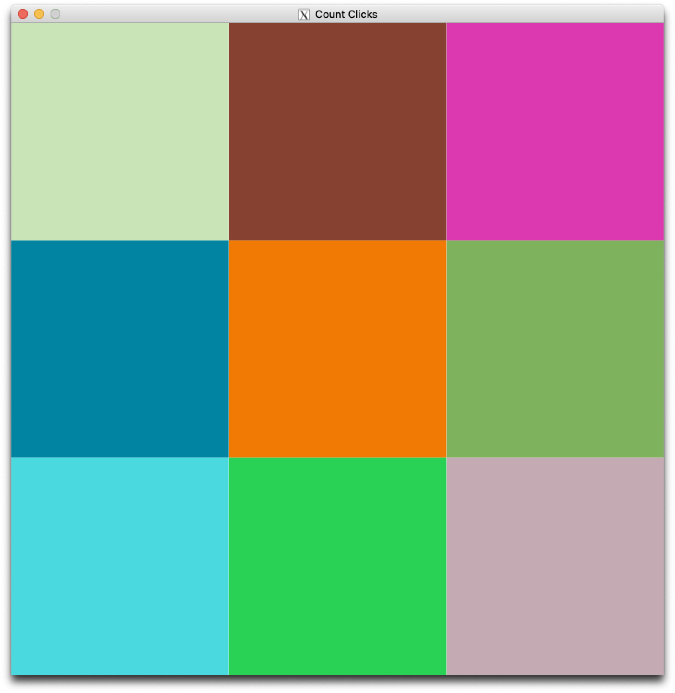

# CSCI 1103 Computer Science 1 Honors

### Fall 2020

Robert Muller - Boston College

---

## Lab 9: Working with Two-Dimensional Arrays

This lab has two options, **one**: to write OCaml code to determine whether or not a 2D array of integers is a [Sudoku](https://sudoku.game/) solution, and **two**: to write an OCaml program to count the number of clicks on each square of a 3x3 grid of colored checks. The first option would be a good choice for students thinking of writing a Sudoku solver for problem set 10. The second option would be a good choice for students considering one of the graphical options such as the [Knobster](https://mazechazer.gitlab.io/knobster/) or [2048](https://play2048.co/) games for problem set 10.

#### Option 1: Sudoku Checker

This problem involves completing code in the `checkSudoku/` directory. The goal of the app is to determine whether or not a 9x9 2D-array of integers represents a solved Sudoku puzzle. A sudoku puzzle is solved when each row, each column and each 3x3 subgrid contains all 9 integers 1..9 with no duplicates.

#### Option 2: Counting Clicks

This problem involves extending the *model-view-update* app in the `countClicks/` directory. The existing app shows a 3x3 grid of checks. The extension should add code that will count the number of touchpad clicks on each check. The extended application should count 5 clicks using a 2D-array of integer counters, one for each square. After 5 clicks, the image should change from the 3x3 grid to one solid color. When the user X's-out that image, the application should print out the array of counts in two dimensions. For example, given the image

  

if the user clicked once on the turquoise check, three times on the orange check and once on the pink check, the program should replace the grid with a solid color, and when that window is X-ed out, the counts should be printed to the console (using `Lib.pfmt`) as in

```
0 0 1
0 3 0
1 0 0
```

 

 


